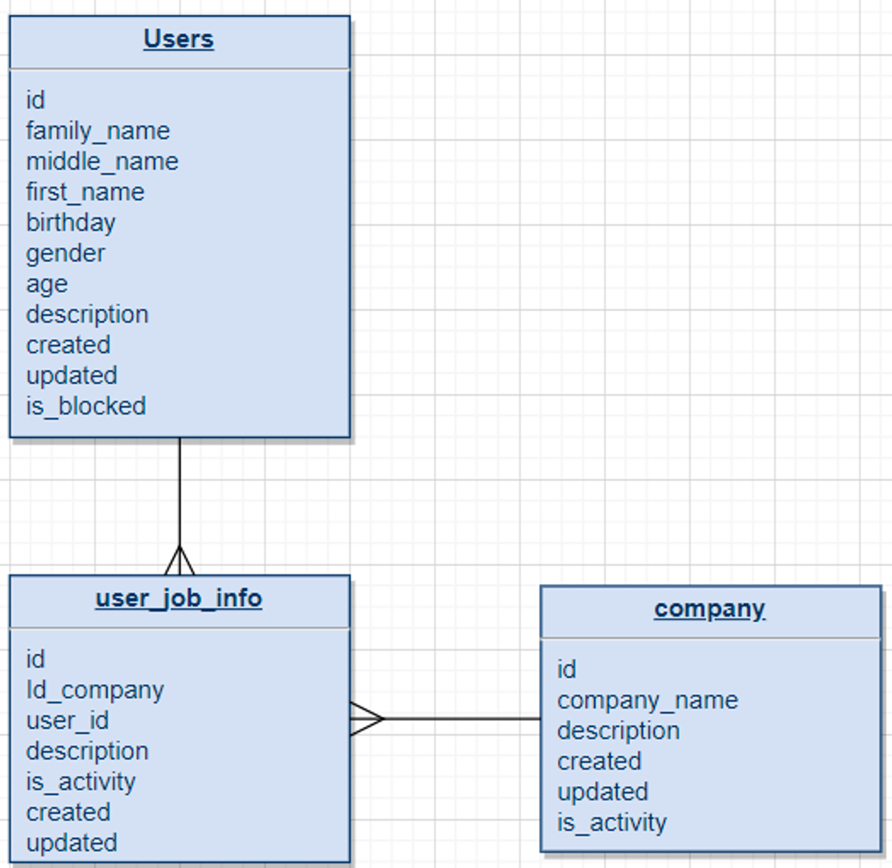

# userjob-service
#Тестовое задание

___
**Используемые технологии:**
<ul>
<li>Java 17</li>
<li>Spring Boot 3</li>
<li>Spring WEB</li>
<li>H2 database</li>
<li>JPA</li>
<li>Lombok</li>
</ul>

---

**Требования к разработке**

Реализовать новый микросервис (userjob-service).
Микросервис должен позволять создавать, обновлять, получать данные о пользователях и компаниях.
Требования включают в себя следующее:
1. Разработка новой схемы в БД к микросервису согласно описанной модели данных.
2.	Разработка методов микросервиса:
<ul>
<li>POST - /create-userjob</li>
<li>PATCH - /update-userjob</li>
<li>GET - /get-userjob</li>
</ul>

**Модель данных**

**Реализация задания**

В контроллере UserjobController реализовано три метода для решения поставленной задачи:
<ul>
<li>getData - получение данных о пользователе/компании</li>
<li>createData - создание записей в БД</li>
<li>updateDate - обновление записей в БД</li>
</ul>

Создан тестовый класс UserjobControllerTest, позволяющий протестировать работу микросервиса.
В папке "src/main/resources/HTTP Request" расположены HTTP запросы позволяющие дополнительно проверить работу микросервиса.